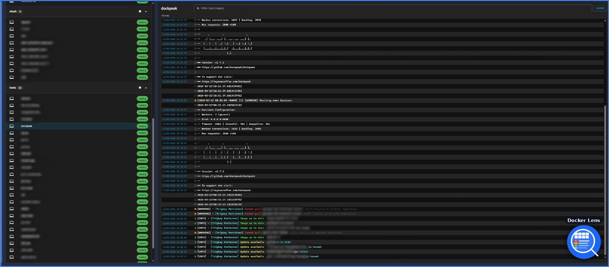

# Docker Lens for Home Assistant

[](https://github.com/hacs/integration)
[](https://github.com/Anrolosia/docker_lens/releases)
[](LICENSE)

A Home Assistant integration that streams Docker container logs in real time, directly in your HA sidebar — no external service required.



## Motivation

I run Home Assistant alongside a stack of Docker containers on the same host. When something broke, I always had to jump out of HA and open [Dozzle](https://dozzle.dev/) — a fantastic standalone Docker log viewer — in a separate tab.

Docker Lens was built to close that gap: bring Dozzle-style real-time log streaming directly into Home Assistant, using HA's own WebSocket infrastructure. No extra service to run, no separate browser tab — your logs live right next to your automations.

> **Credit:** The log viewer UI concept is heavily inspired by [Dozzle](https://dozzle.dev/) by [amir20](https://github.com/amir20). Docker Lens is an independent project and is not affiliated with or endorsed by the Dozzle project.

## Features

- **Real-time log streaming** — logs appear as they are written, with no polling.
- **Stack grouping** — containers are organized by their Docker Compose project (`com.docker.compose.project` label).
- **Merged-stack view** — stream all containers in a stack into a single merged view, each line color-coded by container name.
- **Log-level coloring** — lines are automatically classified and colored (`ERR`, `WRN`, `INF`, `DBG`, `TRC`).
- **JSON log detection** — JSON lines are automatically detected, the message extracted, and all fields viewable via an expandable panel.
- **Logfmt detection** — `key=value` log lines are colorized with keys in purple and values in green.
- **Timestamp grouping** — lines sharing the same timestamp are grouped visually, with the timestamp and level indicator shown only once.
- **Multiline grouping** — stack traces (Python, Java, generic indented lines) are automatically grouped and collapsible.
- **Sidebar search** — filter containers and stacks by name in real time.
- **Regex filtering** — filter logs in real time by plain text or regular expression.
- **Auto-scroll toggle** — auto-scroll pauses when you scroll up manually and resumes with one click.
- **Container actions** — start, stop, and restart containers directly from the sidebar (requires additional socket proxy permissions — see [Container Actions](#container-actions)).
- **Real-time container stats** — CPU%, memory usage, and network RX/TX streamed live every 2 seconds when a container is selected.
- **Local and remote Docker** — works with a local Unix socket or a remote TCP daemon (plain or TLS).
- **Adaptive theme** — follows the Home Assistant light / dark mode automatically.
- **Stateless** — no logs are stored; they are streamed directly from the Docker daemon.
- **Admin-only panel** — the sidebar panel requires HA admin access.

## Requirements

- Home Assistant **2024.6.0** or later
- [HACS](https://hacs.xyz/) (recommended for installation)
- Docker accessible from the Home Assistant host:
  - **Local** — Docker on the same host with the socket mounted (`/var/run/docker.sock`)
  - **Remote** — Docker exposed over TCP on another machine (e.g. `tcp://192.168.1.x:2375`), optionally with TLS

> **Security tip:** For remote access, use a proxy such as [Tecnativa/docker-socket-proxy](https://github.com/Tecnativa/docker-socket-proxy) instead of exposing the raw Docker socket over TCP. See [Container Actions](#container-actions) for the required configuration when using a socket proxy.

---

## Installation

### Via HACS (recommended)

1. Open HACS in your Home Assistant UI.
2. Go to **Integrations** → click the three-dot menu (⋮) → **Custom repositories**.
3. Paste the URL of this repository, choose category **Integration**, then click **Add**.
4. Close the dialog. **Docker Lens** will now appear in the integration list.
5. Click **Download** and follow the prompts.
6. Restart Home Assistant.

### Manual

1. Download the [latest release](https://github.com/Anrolosia/docker_lens/releases/latest).
2. Copy the `custom_components/docker_lens` folder into your HA `config/custom_components/` directory (create it if it does not exist).
3. Restart Home Assistant.

---

## Configuration

1. Go to **Settings** → **Devices & Services**.
2. Click **+ Add Integration** and search for **Docker Lens**.
3. Fill in the form:

   | Field | Description |
   |-------|-------------|
   | **Docker Host URL** | Socket or TCP endpoint (see examples below) |
   | **Enable TLS** | Check when using a TLS-secured TCP endpoint |
   | **CA Certificate path** | Absolute path on the HA host, e.g. `/config/certs/ca.pem` |
   | **Client Certificate path** | Absolute path on the HA host, e.g. `/config/certs/cert.pem` |
   | **Client Key path** | Absolute path on the HA host, e.g. `/config/certs/key.pem` |

   **Docker Host URL examples:**
   ```
   unix:///var/run/docker.sock   # local socket (default)
   tcp://192.168.1.x:2375        # remote, no TLS
   tcp://192.168.1.x:2376        # remote, TLS
   ```

4. Click **Submit**. The integration tests the connection before saving.

Once added, a **Docker Lens** entry appears in your sidebar.

---

## Usage

1. Click **Docker Lens** in the Home Assistant sidebar.
2. The left panel lists your Docker stacks and containers. Use the **search bar** at the top to filter by name.
3. Click a container name to start streaming its logs and view its real-time stats (CPU, memory, network).
4. Click the **stack icon** (⊞) next to a stack name to merge all containers in that stack into a single log view.
5. Use the **filter bar** to search logs by plain text or regular expression.
6. Use the **auto-scroll button** (⬇) in the toolbar to pause or resume automatic scrolling.
7. Click the **⋮ menu** next to any container to start, stop, or restart it.
8. Click **Clear** to wipe the current log buffer.

### Log formats

Docker Lens automatically detects and renders the following log formats:

| Format | Detection | Display |
|--------|-----------|---------|
| **Plain text** | Default | Level dot + message |
| **JSON** | Line contains a `{...}` object | `JSON` badge, message extracted, click to expand all fields |
| **Logfmt** | Line contains ≥ 2 `key=value` pairs | `FMT` badge, keys in purple, values in green |

---

## Container Actions

The start, stop, and restart buttons require write access to the Docker API.

If you connect directly to the Docker socket (`unix:///var/run/docker.sock`) or a raw TCP daemon, actions work out of the box.

If you use [Tecnativa/docker-socket-proxy](https://github.com/Tecnativa/docker-socket-proxy), you must add the following variables to your proxy configuration:

```yaml
socket-proxy:
  image: tecnativa/docker-socket-proxy:latest
  environment:
    - DISABLE_DEFAULT=1
    # Read access — required for log streaming and stats
    - PING=1
    - VERSION=1
    - INFO=1
    - CONTAINERS=1
    - EVENTS=1
    # Write access — required for start/stop/restart actions
    - POST=1          # Master switch for all write operations — required
    - ALLOW_START=1
    - ALLOW_STOP=1
    - ALLOW_RESTARTS=1
```

> **Important:** `POST=1` is the master switch for all HTTP POST requests to the Docker API. Without it, `ALLOW_START`, `ALLOW_STOP`, and `ALLOW_RESTARTS` have no effect and all container actions will return a `403 Forbidden` error.

---

## Development

### Prerequisites

- Docker and Docker Compose
- Node.js ≥ 18 and npm (for frontend work)

### Quick start

```bash
git clone https://github.com/Anrolosia/docker_lens.git
cd docker_lens
cp .env.example .env
docker compose up --build
```

- Home Assistant: `http://localhost:8123`
- Vite dev server: `http://localhost:5173`

### Backend

Python files live under `custom_components/docker_lens/`. Changes are picked up immediately via the Docker volume mount; restart HA from **Developer Tools → YAML → Restart** to apply them.

### Frontend

```bash
cd frontend
npm install
npm run build    # production build → custom_components/docker_lens/frontend/dist/
```

### Running tests

```bash
pip install -r requirements_test.txt
pytest tests/
```

---

## Troubleshooting

| Symptom | Likely cause |
|---------|-------------|
| Panel shows "Failed to fetch containers" | HA cannot reach the Docker daemon — check the host URL and that the socket/port is exposed. |
| No containers listed | The Docker daemon is reachable but has no running or stopped containers. |
| Logs stop streaming | The container exited. The stream ends naturally when the process stops. |
| Container actions return 403 | `POST=1` is missing from your docker-socket-proxy configuration — see [Container Actions](#container-actions). |
| TLS errors | Certificate paths must be absolute paths accessible from inside the HA container. |

---

## Contributing

Pull requests and issues are welcome! Please open an issue before submitting a large change.

## License

This project is licensed under the [MIT License](LICENSE).